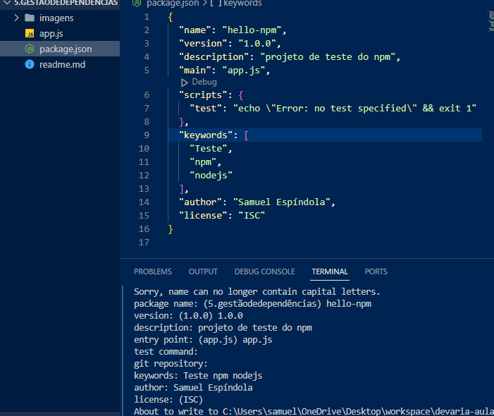
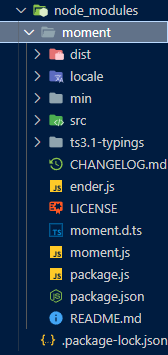
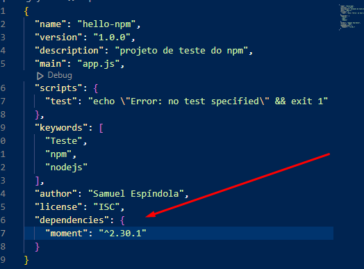

# Vamos falar um pouco sobre depedências e gestão das mesmas aqui nesse repositório

Bibliotecas/Pacotes/Libs todos esses são termos que se referem a mesma coisa, são 
ferramentas disponibilizdas por empresas ou pela comunidade a fim de servir como utilitário
para seu código, sem que você tenha que escrever para todo novo projeto tarefas repetitivas 
como conexões com banco de dados, validações de formulários e etc... 
Veremos isso de forma prática nos próximos slides.

Mas como vamos conhecer todas essas infinidades de bibliotecas e frameworks, além de controlá-las, também precisamos adicionar essas bibliotecas ao nosso projeto.

No NPM, geralmente, esse código é fornecido em "pacotes",juntamente com outro conteúdo necessário nos projetos que consomem esses pacotes.
Em suma, um pacote do NPMé o conjunto de arquivos .js necessários para executar a proposta a qual a lib foi desenvolvida, além de outros arquivos relacionados
a esse código e um manifesto descritivo que inclui informações como o número de versão do pacote, informações do repositório e tudo mais.

Como o NPMoferece suporte a hosts privados junto com o host público nuget.org, é possível usar pacotes NPMpara compartilhar código exclusivo a uma organização ou a um grupo de trabalho.

Você também pode usar os pacotes como uma forma conveniente de levar em consideração seu próprio código para uso em nada além de seus próprios projetos.

Em resumo, um pacote é uma unidade compartilhável de código, mas não exige nem implica qualquer meio específico de compartilhamento.

Além do NPM existe também o gerenciador de pacotes Yarn, poém vamos focar o uso do npm durante o curso.

Tanto o NPM quanto Yarn utilizam o arquivo package.json para definir as dependências e versões para aquele projeto e também o package-lock.json 
para garantir que todos os devs utilizem a mesma versão dos pacotes.

## Iniciar um NPM
### npm init

Quando eu der esse comando no console ele vai começar a me perguntar um monte de coisas, como:

* Nome Do Projeto;
* version;
* Descrição;
* Arquivo De Entrada;
* test commnad:
* repositorio do git;
* palavras Chave;
* Autor;
* Licença.

no final vai ficar mais ou menos assim:




## Importar uma biblioteca
### npm i *nomeDaBibliotecaNoNPM*

usando esse comando ele vai baixar os arquivos no npm, e vai modificar/criar 3 novos arquivos

sendo eles:

* node_modules --> Onde ficam minhas dependências



* package.json --> vai criar uma parte para as dependências



* package-lock.json --> fala de onde baixou, pode ignorar esse arquivo


## Subir no meu git

Faz algum sentido eu subir esses arquivos da minha depedência dentro do meu repositorio remoto? Não, pois essas dependências já estão no NPM.

Para resolver isso eu devo ignorar esse arquivos, criando um arquivo .gitignore:

```gitignore
node_modules/
package-lock.json
```

Desse jeito eu vou ignorar os arquivos, e não vou subir eles, vão apenas mantelos na minha máquina.
